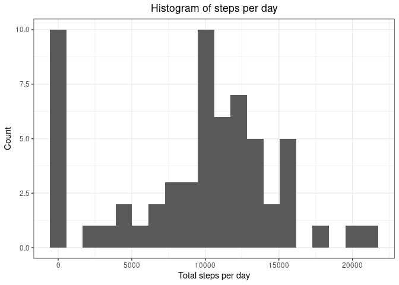
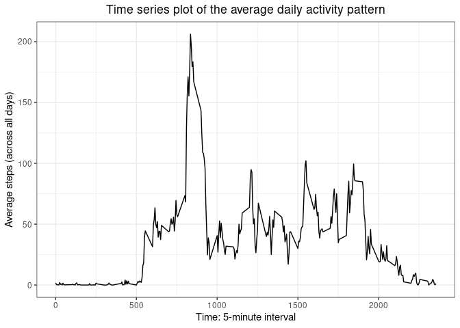
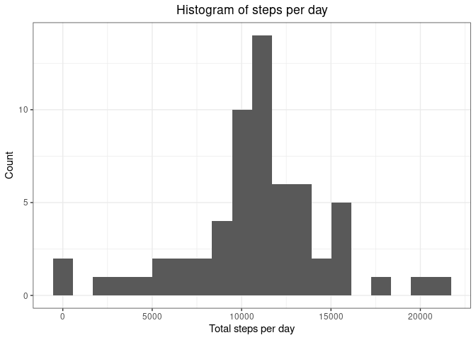
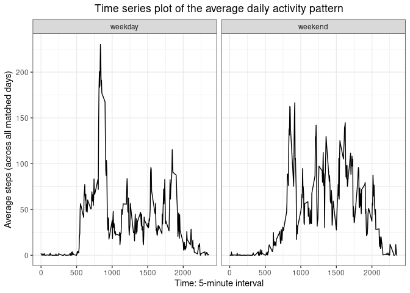

## Setting up environment

```r
library(readr)
library(tidyverse)
```

```
## ─ Attaching packages ──────────────────── tidyverse 1.3.0 ─
```

```
## ✓ ggplot2 3.3.3     ✓ dplyr   1.0.5
## ✓ tibble  3.1.0     ✓ stringr 1.4.0
## ✓ tidyr   1.1.3     ✓ forcats 0.5.1
## ✓ purrr   0.3.4
```

```
## ─ Conflicts ───────────────────── tidyverse_conflicts() ─
## x dplyr::filter() masks stats::filter()
## x dplyr::lag()    masks stats::lag()
```

## Loading and preprocessing the data

Loading the data, into default working directory.
Previewing the data with `head()`.


```r
fileURL <- "https://d396qusza40orc.cloudfront.net/repdata%2Fdata%2Factivity.zip"
download.file(fileURL, "./data.zip")
unzip("./data.zip")

DATA <- read_csv("activity.csv", na = "NA")
```

```
## 
## ─ Column specification ────────────────────────────
## cols(
##   steps = col_double(),
##   date = col_date(format = ""),
##   interval = col_double()
## )
```

```r
head(DATA)
```

```
## # A tibble: 6 x 3
##   steps date       interval
##   <dbl> <date>        <dbl>
## 1    NA 2012-10-01        0
## 2    NA 2012-10-01        5
## 3    NA 2012-10-01       10
## 4    NA 2012-10-01       15
## 5    NA 2012-10-01       20
## 6    NA 2012-10-01       25
```

## What is mean total number of steps taken per day?
For this part of the assignment, you can ignore the missing values in the dataset.

**1. Calculate the total number of steps taken per day**


```r
library(tidyverse)
df.sumsteps <- DATA %>% group_by(date) %>% summarize(steps_sum = sum(steps, na.rm = TRUE))
head(df.sumsteps)
```

```
## # A tibble: 6 x 2
##   date       steps_sum
##   <date>         <dbl>
## 1 2012-10-01         0
## 2 2012-10-02       126
## 3 2012-10-03     11352
## 4 2012-10-04     12116
## 5 2012-10-05     13294
## 6 2012-10-06     15420
```

The question did not specify which day it wants to know. 
The calculation and the result dataframe is shown above.

**2. If you do not understand the difference between a histogram and a barplot, research the difference between them. Make a histogram of the total number of steps taken each day.**


```r
ggplot(data = df.sumsteps, aes(steps_sum)) + 
  geom_histogram(bins = 20) + 
  ggtitle("Histogram of steps per day") +
  xlab("Total steps per day") +
  ylab("Count") +
  theme_bw() +
  theme(plot.title = element_text(hjust = 0.5))
```

<!-- -->

Note that "0" includes those days with NA data.

**3. Calculate and report the mean and median of the total number of steps taken per day**


```r
summary(df.sumsteps$steps_sum)
```

```
##    Min. 1st Qu.  Median    Mean 3rd Qu.    Max. 
##       0    6778   10395    9354   12811   21194
```
As from the summary above, the mean of the total number of steps taken per day is 9354, and the median is 10395.

## What is the average daily activity pattern?

**1. Make a time series plot (i.e. ``type = "l"``) of the 5-minute interval (x-axis) and the average number of steps taken, averaged across all days (y-axis).**


```r
# prepare dataset
df.avgpattern <- DATA %>% group_by(interval) %>%
  summarize(avg_steps = mean(steps, na.rm = TRUE))
head(df.avgpattern)
```

```
## # A tibble: 6 x 2
##   interval avg_steps
##      <dbl>     <dbl>
## 1        0    1.72  
## 2        5    0.340 
## 3       10    0.132 
## 4       15    0.151 
## 5       20    0.0755
## 6       25    2.09
```

```r
# time series plot
ggplot(data = df.avgpattern, aes(interval, avg_steps)) +
  geom_line() +
  ggtitle("Time series plot of the average daily activity pattern") +
  xlab("Time: 5-minute interval") +
  ylab("Average steps (across all days)") +
  theme_bw() +
  theme(plot.title = element_text(hjust = 0.5))
```

<!-- -->


**2. Which 5-minute interval, on average across all the days in the dataset, contains the maximum number of steps?**


```r
df.avgpattern$interval[which.max(df.avgpattern$avg_steps)]
```

```
## [1] 835
```
The interval "835" contains the maximum number of steps.

## Imputing missing values

**1. Calculate and report the total number of missing values in the dataset (i.e. the total number of rows with ```NAs```) **


```r
nrow(DATA) - sum(complete.cases(DATA))
```

```
## [1] 2304
```

```r
# or sum(is.na(DATA$steps))
```

The total number of rows with NAs is 2304.

**2. Devise a strategy for filling in all of the missing values in the dataset. The strategy does not need to be sophisticated. For example, you could use the mean/median for that day, or the mean for that 5-minute interval, etc.**
**3. Create a new dataset that is equal to the original dataset but with the missing data filled in.**


```r
# Identify the rows with NAs
na.rows <- !complete.cases(DATA)
# Fetch the mean of that interval from previous dataframe and fill in
DATA2 <- DATA
for (i in 1:nrow(DATA)){
  if (na.rows[i])
  DATA2$steps[i] <- df.avgpattern$avg_steps[df.avgpattern$interval == DATA2$interval[i]]
}
# View filled dataset
head(DATA2)
```

```
## # A tibble: 6 x 3
##    steps date       interval
##    <dbl> <date>        <dbl>
## 1 1.72   2012-10-01        0
## 2 0.340  2012-10-01        5
## 3 0.132  2012-10-01       10
## 4 0.151  2012-10-01       15
## 5 0.0755 2012-10-01       20
## 6 2.09   2012-10-01       25
```

```r
summary(DATA2)
```

```
##      steps             date               interval     
##  Min.   :  0.00   Min.   :2012-10-01   Min.   :   0.0  
##  1st Qu.:  0.00   1st Qu.:2012-10-16   1st Qu.: 588.8  
##  Median :  0.00   Median :2012-10-31   Median :1177.5  
##  Mean   : 37.38   Mean   :2012-10-31   Mean   :1177.5  
##  3rd Qu.: 27.00   3rd Qu.:2012-11-15   3rd Qu.:1766.2  
##  Max.   :806.00   Max.   :2012-11-30   Max.   :2355.0
```

**4. Make a histogram of the total number of steps taken each day and Calculate and report the mean and median total number of steps taken per day. Do these values differ from the estimates from the first part of the assignment? What is the impact of imputing missing data on the estimates of the total daily number of steps?**


```r
df.sumsteps2 <- DATA2 %>% group_by(date) %>% summarize(steps_sum = sum(steps))
ggplot(data = df.sumsteps2, aes(steps_sum)) + 
  geom_histogram(bins = 20) + 
  ggtitle("Histogram of steps per day") +
  xlab("Total steps per day") +
  ylab("Count") +
  theme_bw() +
  theme(plot.title = element_text(hjust = 0.5))
```

<!-- -->

```r
summary(df.sumsteps2)
```

```
##       date              steps_sum    
##  Min.   :2012-10-01   Min.   :   41  
##  1st Qu.:2012-10-16   1st Qu.: 9819  
##  Median :2012-10-31   Median :10766  
##  Mean   :2012-10-31   Mean   :10766  
##  3rd Qu.:2012-11-15   3rd Qu.:12811  
##  Max.   :2012-11-30   Max.   :21194
```
The **mean** total number of steps taken per day is 10766, and the **median** is now 10766.
The impact of imputing missing data is the decrease of abnormal "0" total steps data.
The overall "shape" of the histogram has not changed much.

## Are there differences in activity patterns between weekdays and weekends?
For this part the ```weekdays()``` function may be of some help here. Use the dataset with the filled-in missing values for this part.

**1. Create a new factor variable in the dataset with two levels – “weekday” and “weekend” indicating whether a given date is a weekday or weekend day.**


```r
Sys.setlocale("LC_TIME", "C")
```

```
## [1] "C"
```

```r
DATA3 <- DATA2 %>% mutate(wkd = weekdays(date)) %>%
  mutate(wknd = fct_collapse(wkd, "weekday" = c("Monday", "Tuesday", "Wednesday", "Thursday", "Friday"), "weekend" = c("Saturday", "Sunday")))
str(DATA3$wknd)
```

```
##  Factor w/ 2 levels "weekday","weekend": 1 1 1 1 1 1 1 1 1 1 ...
```
The factor requested is "wknd" as above.

**2. Make a panel plot containing a time series plot (i.e. ```type = "l"```) of the 5-minute interval (x-axis) and the average number of steps taken, averaged across all weekday days or weekend days (y-axis). See the README file in the GitHub repository to see an example of what this plot should look like using simulated data.**


```r
df.avgpattern3 <- DATA3 %>% group_by(interval, wknd) %>% summarize(avg_steps = mean(steps, na.rm=TRUE))
```

```
## `summarise()` has grouped output by 'interval'. You can override using the `.groups` argument.
```

```r
# time series plot
ggplot(data = df.avgpattern3, aes(interval, avg_steps)) +
  geom_line() +
  facet_grid(cols = vars(wknd)) +
  ggtitle("Time series plot of the average daily activity pattern") +
  xlab("Time: 5-minute interval") +
  ylab("Average steps (across all matched days)") +
  theme_bw() +
  theme(plot.title = element_text(hjust = 0.5))
```

<!-- -->

